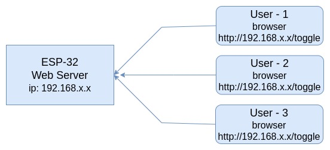
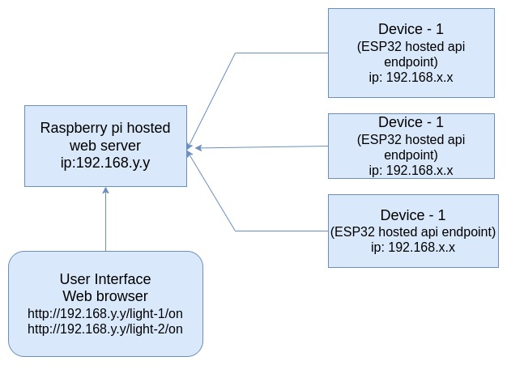

# IoT-Based Home Automation  


### 1. Controling an Appliance using ESP32

Description:
The ESP32 hosts a server that allows you to control an appliance (e.g., a bulb) through a web interface. Access the control interface by visiting a specific URL in your browser.

#### Components Required
1. **ESP32:** Microcontroller with built-in Wi-Fi for hosting the server and controlling the relay.  
2. **Relay Module:** Acts as a switch to control the appliance.  
3. **Bulb:** The appliance to be controlled (can be replaced with any compatible device like a fan or motor).

  
---

### 2. Combining multiple appliances 
**ESP32 as a Server:** When each ESP32 operates as an independent web server, controlling multiple appliances requires accessing different IP addresses or URLs, which can become difficult as the number of devices increases.  
**Raspberry Pi as a Server:** The Raspberry Pi acts as a centralized hub, offering a unified control interface. This makes it easier to manage and control multiple devices from a single dashboard.

#### Components Required:
1. **Multiple Modules created in the first project**
2. **Raspberry Pi**: Acts as a central web server
 
Description:
In this setup, multiple ESP32 devices are controlled through a Raspberry Pi server. The Raspberry Pi manages communication with each ESP32, allowing you to control several appliances from a single interface.

**Installing Node js:**  
```bash
#install nvm(Node Version Manager)
curl -o- https://raw.githubusercontent.com/nvm-sh/nvm/v0.40.0/install.sh | bash

# restart the terminal
nvm install 22

#check the installed node version
node -v

```

